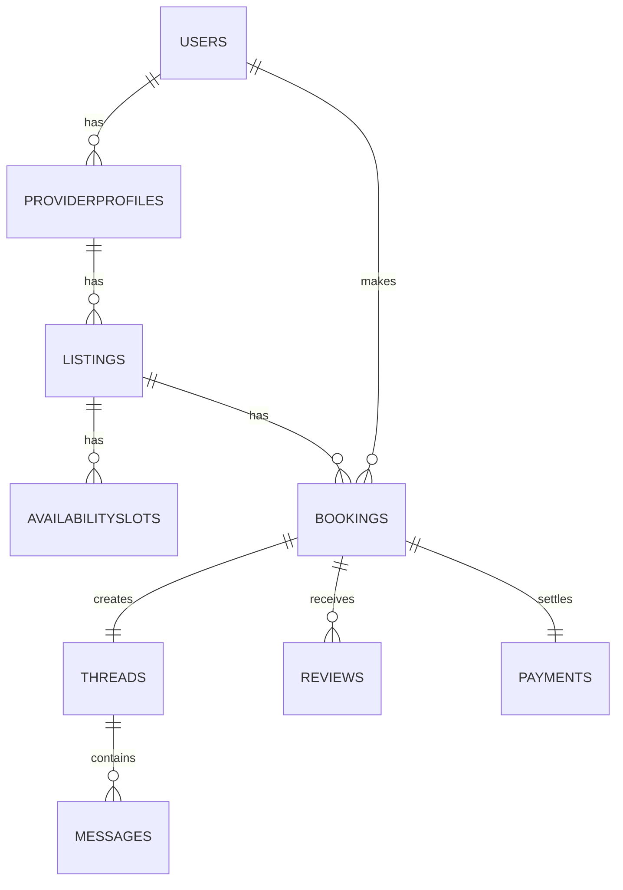

# Sydney Service Marketplace — Dev‑Demo Plan (README)

A lean, interview‑ready marketplace for local services (Airtasker‑style) that proves full‑stack craft: auth, provider onboarding, search + map, booking + Stripe (test), receipts, basic chat, admin moderation, tests, and a deployed URL. Built to run on free/near‑free tiers.

---

## 0) Scope & Success Criteria

**Goal:** an 8–12 min demo showing breadth and reliability on a live URL.

**In‑scope:**

* Auth & roles (Customer, Provider, Admin)
* Provider onboarding (profile, photo, GST toggle, optional ABN stub)
* Listings CRUD + photos
* Search (SSR) + map (client) with radius filter
* Availability slots → Booking hold → Stripe test payment → Webhook → Receipt email
* Basic chat on each booking (realtime)
* Reviews & average rating
* Mini admin console (moderation/refund link)
* Tests (unit/integration/E2E) and CI

**Out‑of‑scope (stub/simplify):** payouts (Stripe Connect UI), real ABN web service, disputes workflow, heavy analytics.

**Demo acceptance:**

* ✅ Seeded data makes Sydney searches look real
* ✅ Stripe test card flow works end‑to‑end (idempotent webhooks)
* ✅ Chat updates live; reviews gated by completed booking
* ✅ Admin can deactivate listings; actions audited

---

## 1) Tech Stack (lean, hire‑friendly)

* **Frontend:** Next.js 14 (App Router, RSC + Route Handlers), TypeScript, TailwindCSS + shadcn/ui, React Hook Form + Zod, TanStack Query (selectively), date‑fns‑tz, Mapbox GL JS.
* **Backend:** Next.js API Route Handlers, Prisma ORM, **Supabase** (Postgres + Auth + Storage + Realtime) with **Row‑Level Security**.
* **Payments:** Stripe (test mode) + webhooks.
* **Email:** Resend (or Supabase SMTP) with React Email/MJML templates.
* **Infra/DevOps:** Vercel (Hobby), Supabase (Free), GitHub Actions (lint/test), Dependabot/Renovate.
* **Quality:** ESLint/Prettier, Vitest/Jest, Playwright, Zod validation, Sentry (optional) or structured JSON logs.

**Monorepo layout:**

```text
/apps/web           # Next.js app (routes, components, server actions)
/packages/db        # Prisma schema, client, seed scripts
/packages/ui        # Shared components, form controls, icons
/.github/workflows  # CI: lint, test, build, deploy
```

---

## 2) Data Model (minimal, realistic)

**Tables (key fields):**

* **Users**: id, role('CUSTOMER'|'PROVIDER'|'ADMIN'), name, email, phone, created\_at
* **ProviderProfiles**: id, user\_id→Users, display\_name, abn?, gst\_registered, bio, photo\_url, suburb, lat, lng, avg\_rating
* **Listings**: id, provider\_id→ProviderProfiles, title, category, description, price\_per\_hour\_cents, min\_hours, photo\_urls\[], active, created\_at, ts\_vector
* **AvailabilitySlots**: id, listing\_id→Listings, starts\_at(UTC), ends\_at(UTC), status('OPEN'|'HELD'|'BOOKED'), unique(listing\_id, starts\_at)
* **Bookings**: id, listing\_id, customer\_id→Users, slot\_id→AvailabilitySlots, hours, subtotal\_cents, gst\_cents, total\_cents, status('PENDING\_PAYMENT'|'PAID'|'CANCELLED'|'REFUNDED'), created\_at
* **Payments**: id, booking\_id→Bookings, stripe\_payment\_intent\_id, status, events\_json
* **Threads**: id, booking\_id→Bookings, participant\_ids\[]
* **Messages**: id, thread\_id→Threads, sender\_user\_id→Users, body, created\_at
* **Reviews**: id, booking\_id→Bookings, rating(1–5), comment, created\_at
* **AdminFlags**: id, entity\_type, entity\_id, reason, created\_at, resolved\_by
* **AuditLogs**: id, actor\_user\_id, action, entity, entity\_id, at

> **GST math:** `gst_cents = round(subtotal_cents * 0.10)`; `total = subtotal + gst`. If showing GST‑inclusive → GST is 1/11th of total.

**(Optional) Mermaid ER sketch:**



---

## 3) Feature Slices & Acceptance

### A) Auth & Roles

* Email/password + magic link (Supabase). Role badge in navbar.
* **AC:** Route guards redirect correctly; RLS policies enforce ownership.

### B) Provider Onboarding

* Form: display name, optional ABN (checksum stub), GST toggle, bio, hero photo upload.
* **AC:** Profile persists; photo rendered; only owner can edit.

### C) Listings CRUD

* Multi‑photo upload, price/hour, min hours, status active/inactive.
* **AC:** SSR listing page renders <200ms TTFB (local); search finds it.

### D) Search + Map

* SSR search by keyword/category + server pagination; client Mapbox with markers and 10–20km radius.
* **AC:** Query “plumber” near Hurstville returns seeded providers; pagination works.

### E) Availability & Booking

* Provider adds slots; customer selects slot → create `PENDING_PAYMENT` booking; slot `HELD` (10‑min TTL) to prevent double‑booking.
* Create Stripe PaymentIntent → confirm with test card → webhook marks `PAID`, slot → `BOOKED`; send receipt email (GST shown).
* **AC:** Repeated “Pay” clicks don’t double‑charge; webhook idempotent; totals correct.

### F) Chat (basic)

* Auto‑create thread on booking; realtime messages via Supabase Realtime.
* **AC:** Two browsers exchange messages; history loads on refresh.

### G) Reviews

* Customer may review after end‑time of a paid booking.
* **AC:** Average rating updates; only one review per booking.

### H) Admin Mini‑Console

* Tables for users/listings/flags; deactivate listing; link to Stripe dashboard for refund; log actions in AuditLogs.
* **AC:** Guarded by `role===ADMIN`; changes reflected in search.

### I) Light PWA

* Install prompt, offline shell caching; background sync for pending chat.
* **AC:** App loads shell offline; messages queued then sent.

---

## 4) API Surface (Route Handlers)

```
GET  /api/listings?query=&category=&lat=&lng=&radius_km=&page=
POST /api/listings
PUT  /api/listings/:id
DEL  /api/listings/:id
GET  /api/listings/:id/slots
POST /api/listings/:id/slots
POST /api/bookings                 # creates PENDING + PaymentIntent
GET  /api/bookings/:id
POST /api/bookings/:id/cancel
POST /api/stripe/webhook           # idempotent webhook handler
GET  /api/threads/:id/messages
POST /api/threads/:id/messages
POST /api/reviews
GET  /api/admin/...
```

**Validation:** Zod schemas for every payload; server strips unknown fields.

---

## 5) UI Routes (App Router)

* `/` Home (search bar, featured categories)
* `/auth/*` Sign in/up
* `/providers/onboarding` Profile form
* `/providers/listings` + `/providers/listings/new|:id`
* `/l/:listingId` Listing detail (photos, price, rating, calendar)
* `/l/:listingId/book` Booking & payment
* `/me/bookings` Purchases & receipts
* `/messages/:threadId` Chat
* `/admin` Mini console
* `/legal/terms`, `/legal/privacy`

---

## 6) Dev Setup

**Prereqs:** Node 20, pnpm, GitHub, Vercel CLI, Supabase CLI, Stripe CLI.

```bash
# 1) Create app
pnpm create next-app@latest apps/web --ts --eslint --tailwind --app

# 2) Packages & scaffolding
pnpm add -w prisma @prisma/client zod react-hook-form @tanstack/react-query date-fns date-fns-tz
pnpm add -w @supabase/supabase-js @supabase/auth-helpers-nextjs
pnpm add -w stripe
pnpm add -w class-variance-authority lucide-react

# 3) Init Prisma
pnpm dlx prisma init --datasource-provider postgresql

# 4) Supabase (local optional) or connect to hosted project
supabase login && supabase link --project-ref <ref>

# 5) Env
cp .env.example .env.local
```

**.env.example**

```env
NEXT_PUBLIC_SITE_NAME=Sydney Service Marketplace
NEXT_PUBLIC_MAPBOX_TOKEN=...
NEXT_PUBLIC_SUPABASE_URL=https://xxxx.supabase.co
NEXT_PUBLIC_SUPABASE_ANON_KEY=...
SUPABASE_SERVICE_ROLE_KEY=...
DATABASE_URL=postgresql://...
STRIPE_SECRET_KEY=sk_test_...
STRIPE_WEBHOOK_SECRET=whsec_...
RESEND_API_KEY=re_...
```

**Stripe webhook (dev):**

```bash
stripe listen --forward-to localhost:3000/api/stripe/webhook
```

---

## 7) Seed Data

* 20 providers across Sydney suburbs (CBD, Parramatta, Chatswood, Cronulla, Hurstville, Newtown, Bondi, Manly, Blacktown, Burwood, Hornsby, Penrith).
* Categories: Cleaning, Plumbing, Tutoring, Gardening, Electrician, Personal Training, Piano Lessons.
* Each provider: 3 listings, 6–10 slots (next 2 weeks), 2–5 reviews.

**Example suburb seed JSON:**

```json
[
  {"suburb":"Sydney CBD","lat":-33.8688,"lng":151.2093},
  {"suburb":"Parramatta","lat":-33.8136,"lng":151.0034},
  {"suburb":"Chatswood","lat":-33.7968,"lng":151.1832},
  {"suburb":"Hurstville","lat":-33.9673,"lng":151.1023},
  {"suburb":"Bondi","lat":-33.8915,"lng":151.2767}
]
```

---

## 8) Security & Integrity

* **RLS** for every table; service role used only in secure server contexts.
* **Rate limiting** on auth, search, booking.
* **Idempotency**: store processed Stripe event IDs; prevent double‑booking with slot `HELD` + `expires_at`.
* **Audit logs** for admin actions.
* **PII minimised**: phone optional; no addresses in demo.

---

## 9) Testing Strategy

**Unit (Vitest):**

* Price calculator & GST
* Slot state machine transitions (OPEN ⇄ HELD ⇄ BOOKED)
* Zod schemas (good/bad payloads)

**Integration:**

* Provider onboarding → listing → slots (RLS enforced)
* Search SSR returns seeded results
* Booking: hold slot → PaymentIntent → webhook → PAID

**E2E (Playwright, 6 specs):**

1. Customer signup → search → book → Stripe test → receipt email
2. Provider onboarding → listing publish → slots visible
3. Double‑click Pay doesn’t double‑charge
4. Chat live update + persistence
5. Review only after completed booking
6. Admin deactivates listing → disappears from search

**CI gates:** unit+integration on PR; E2E nightly or on `main`.

---

## 10) Deployment

* **Vercel (Hobby):** connect repo → set env → deploy.
* **Supabase (Free):** create project → copy URL/keys → set RLS policies → run Prisma migrations & seed.
* **Stripe:** add webhook endpoint to Vercel URL.

**Release checklist:**

* [ ] ENV set on Vercel
* [ ] DB migrated and seeded
* [ ] Stripe webhook secret set
* [ ] Test booking with `4242 4242 4242 4242`
* [ ] Lighthouse ≥ 90; axe clean

---

## 11) Ten‑Day Solo Build Plan

**Day 1** – Scaffold, auth, roles, base layout, Prisma schema v1, seed v1.

**Day 2** – Provider onboarding (photo upload, RLS), profile page.

**Day 3** – Listings CRUD + SSR detail page, basic search.

**Day 4** – Mapbox + radius filter + pagination, SEO meta.

**Day 5** – Availability slots UI + state machine + APIs.

**Day 6** – Booking flow (hold/TTL) + totals (GST).

**Day 7** – Stripe PaymentIntent + webhook idempotency + receipt email.

**Day 8** – Chat (Realtime) + Thread lifecycle + unread badges.

**Day 9** – Admin mini‑console + Audit logs + tests (unit/integration).

**Day 10** – Playwright E2E, polish, Lighthouse/a11y, deploy & demo script.

---

## 12) Demo Script (8–12 min)

1. **Pitch** (15s) – "Sydney marketplace for local services."
2. **Auth** (30s) – sign in; role badge.
3. **Provider** (90s) – onboarding → create listing → add slots.
4. **Search+Map** (60s) – plumber near Hurstville; filters.
5. **Booking+Pay** (2–3m) – slot → GST → Stripe → receipt.
6. **Chat & Review** (60s) – message provider; leave review.
7. **Admin** (60s) – deactivate spam listing; audit log; mini metrics.
8. **Architecture** (30s) – RSC + Supabase + Stripe + Realtime.
9. **Next Steps** (30s) – payouts, ABN live check, calendar sync.

---

## 13) Stretch (time‑boxed, optional)

* ICS export; add‑to‑calendar links
* PostGIS radius & clusters; pgvector "similar providers"
* PWA install banner; offline chat queue

---

## 14) Risks & Trade‑offs (for interviews)

* **RSC vs CSR** – SSR search for speed/SEO; chat stays CSR.
* **Supabase coupling** – simplifies RLS/auth at the cost of vendor lock‑in; migration path: NestJS + RDS + Redis.
* **Payments** – test‑mode only; speak to Connect/Payouts roadmap.
* **Queues** – TTL/cron instead of SQS; discuss outbox/Saga if asked.

---

## 15) Commands Quick Reference

```bash
# Dev
pnpm dev

# Prisma
pnpm dlx prisma migrate dev
pnpm dlx prisma studio

# Seed
pnpm ts-node packages/db/seed.ts

# Tests
pnpm vitest
pnpm playwright test

# Stripe webhook local
stripe listen --forward-to localhost:3000/api/stripe/webhook
```

---

## License

MIT (for demo/portfolio use).
